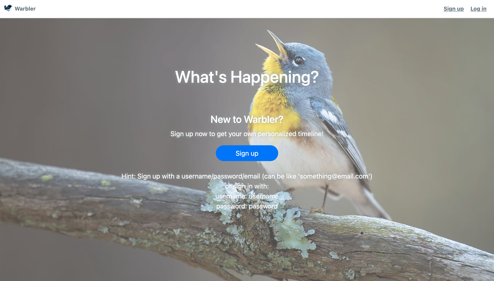

# Flask Warbler
Twitter clone built in Flask Python where users can make posts, follow other users, and like posts.

## Live Demo here: [https://flask-warbler-bt2x.onrender.com/]

## To run on your local machine:

1. Clone the repo
    % git clone https://github.com/clchen-arcadia/flask-warbler.git
    % cd flask-warbler/
3. Create and activate a virtual enviornment with:
    % python3 -m venv venv
    % source venv/bin/activate
4. Then install dependencies with pip3:
    (venv) % pip3 install -r requirements.txt
5. Then run the Flask local host
    % flask run
Or on Macs:
    % flask run -p 5001
And then you can visit the site on your browser at localhost:5000 or localhost:50001
